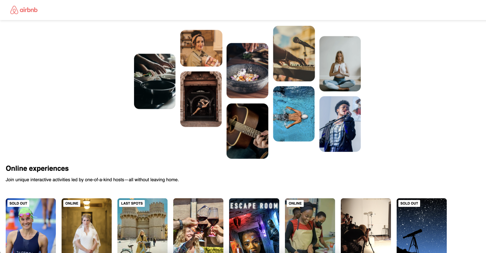

# Airbnb recreation using React.js 🏡

## About the idea
This project is a simple recreation of Airbnb's homepage interface using React.js. I initiated this project with the intent of improving and expanding 🔬 my knowledge on React.js which is a fast, efficient, and scalable JavaScript library used in building user interfaces. For now, it contains special offers on the main page, focusing on the front-end part rather than the back-end aspects for the sake of practice. Detailed features will be implemented in the future.

## Deploy 🚀

<div align="center">
    <a href="https://social-media-app.zeabur.app"><strong> Click here! </strong></a>🚀🚀🚀
</div>

## 🛠 Stack

<div align="center">
<a href="https://www.html.com/">
    
</a>
<a href="https://www.css.com/">
    
</a>
<a href="https://www.javascript.com/">
    
</a>
<a href="https://www.figma.com/">
    
</a>
<a href="https://www.react.com/">
    
</a>
<a href="https://www.nodejs.com/">
    
</a>
<a href="https://www.npm.com/">
    
</a>
</div>

## Looks


## 🔧 Running the Project Locally

To get started developing right away:

1. Clone this repository onto your local machine.
    ```
    git clone https://github.com/username/Airbnb-Recreation-React
    ```

2. Navigate to the project directory and install the dependencies needed.

    ```
    cd Airbnb-Recreation-React/
    npm install
    ```

3. Start the development server, and you should now have the app running on [localhost:3000](http://localhost:3000/).
    ```
    npm start
    ```

Please note you will need Node.js and NPM installed globally on your machine.

## 🌟 Features 

As the main goal of this project was to deepen my understanding and reinforce my skills with React.js, the current features mostly focus on recreating the layout of React Airbnb's homepage.

1. *Modern, Sleek, User-Friendly Interface*: Designed a simple yet functional intuitive user interface similar to the original Airbnb website.

2. *Special Offers*: At present, it has a section where users can view the special offers.

This project is still in the early stages and more features and functionalities are to be added. These will include search capacities, a real-time database, user authentication, among others. 

## 🙏 Contributing
Pull requests are welcomed and greatly appreciated! For major changes, please open an issue first to discuss what you would like to change.

## 🚀 Future Improvements
Recreating modern, dynamic websites offers a great opportunity to learn and explore the expansive React ecosystem. Future improvements for this project include:

- Incorporating a database that dynamically populates special offers 
- Adding Authentication (Sign-up, Sign-in & Sign-out) functionality using Firebase
- Developing a search functionality for users to find and filter offers.

__Feel free to reach out to me with any questions or suggestions.__ 📨